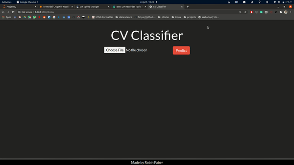

# CV classification app

In this repository you will find my CV classifier app project. The goal of the project was to see if a classifier, trained on job listings, could predict someones job based on their CV. My personal goal was to develop some skills in web scraping, deep learning, and building a simple web-app.
 
In this project I used the following python libraries:
<ul>
    <li>Beautifulsoup: for scraping data</li>
    <li>Tensorflow/Keras: for training the classifier and making predictions</li>
    <li>Flask: for building the app</li>
</ul>

## Visual

## Limitations

This project has some limitations:
 
It looks like the scraped website has a lot of duplicate job listings. Therefore, I ended up with a lot of duplicates in my data that I had to remove. As a result, I ended up with a very small dataset that was highly unbalanced. In the future, I would tweak my scraper function so it doesn't append duplicates and fills up with unique job listings. If necessary I would find another data source to make a bigger dataset.

The trained neural network is not performing very well. Validation accuracy was stuck at just below 80%, and validation loss was slightly going up with each epoch. However, it is performing much better than some of my earlier iterations where loss increased dramatically with each epoch. Some of the things I can do to increase performance are: get more data, keep experimenting with parameters, experiment with simpler or more complex neural networks.

